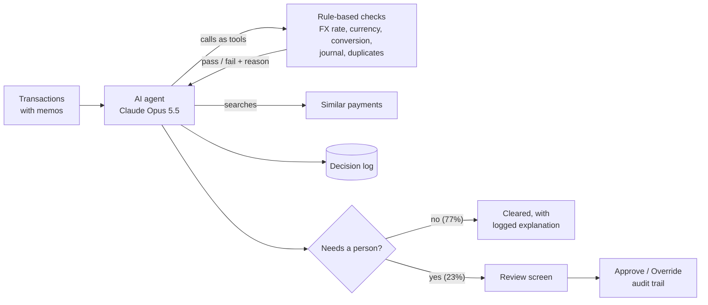

# FX Reconciliation Agent

An AI agent that checks cross-currency payments, explains every discrepancy in plain English, and sends only the cases that need judgement to a human reviewer.

- **120 / 120 test transactions handled correctly**, versus 90% for rule-based checks alone
- **Human review cut from 100% to 23%** of transactions, with every AI decision logged and explained
- **Catches what rules miss:** double payments entered under a new date and journal reference, and legitimate contract rates that rules wrongly flag

### ▶ Watch the demo (2 minutes)

[](https://youtu.be/hOuaMJz5qqs)

## The business problem

While processing payments at Allianz, I found a recurring FX-rate mismatch pattern that caused rework between the payments and FX teams. Checks like this are usually done by hand, one transaction at a time.

Simple rules can catch exact errors, but real ledgers are messier. Memos explain exceptions, and duplicates are rarely exact copies. This project tests where AI adds value on top of rules, and what it costs.

## How it works



1. **Rules first.** Six plain-Python checks (`checks.py`) catch exact errors: wrong FX rate, wrong currency, conversion mismatch, missing or unbalanced journal, and duplicate entry.
2. **The AI uses the rules as tools.** For each transaction, the agent runs the checks, reads the memo, and searches for similar payments. It returns a decision, a plain-English explanation, a suggested fix, and whether a human must review it.
3. **People stay in charge.** Anything flagged or uncertain goes to a review screen where a finance reviewer approves or overrides the AI. Every decision is timestamped.

## Results

Measured on 120 transactions with free-text memos (`data_messy/`), including cases that exact rules get wrong.

| Case | Transactions | Rule-based checks | AI agent (Claude Opus 5.5) | AI agent (Claude Haiku 4.5) |
| --- | --- | --- | --- | --- |
| Clean | 93 | 93 | 93 | 93 |
| Standard errors | 12 | 12 | 12 | 12 |
| Near-duplicates (same invoice re-entered under a new date and journal ref) | 6 | **0** | 6 | 5 |
| Approved exceptions (contract rate explained in memo) | 6 | **0** (false alarms) | 6 | 6 |
| False contract claims (memo rate doesn't match) | 3 | 3 | 3 | 1 |
| **Total correct** | **120** | **108 (90%)** | **120 (100%)** | **117 (97.5%)** |
| Cost per 1,000 transactions | | free | ~$33 | ~$7 |

**Findings**

- **The AI earns its place on the messy cases.** Rules missed every near-duplicate (double payments) and raised a false alarm on every legitimate contract rate. The agent handled all 12 by reading memos and searching for similar payments.
- **Human review drops from 100% to 23% of transactions.** The Opus agent sent 28 of 120 transactions to a person: every flagged error, plus the contract-rate exceptions, which policy says a human must confirm. The other 77% were cleared with a logged, explained decision.
- **The cheaper model is not "good enough" here.** Haiku costs about 5x less, but it silently cleared one double payment. Its two other misses were still sent for human review. For payments, one silent miss outweighs the saving, so Opus is the recommended model; Haiku could do a first pass on low-value transactions.
- **Don't use AI where rules already work.** On the clean, rule-friendly dataset (`data/`, 500 transactions), the rules alone score 500 / 500.

**Estimating savings**

These are scenarios, not measured results. The only measured input is the agent's review rate: 92 of 120 transactions (77%) were cleared without needing a person. Hours saved per week = weekly volume × minutes per manual check × 77% ÷ 60.

| Transactions per week | 3 min per check | 5 min per check | 10 min per check | AI cost per week (Opus) |
| --- | --- | --- | --- | --- |
| 200 | 8 h | 13 h | 26 h | ~$7 |
| 1,000 | 38 h | 64 h | 128 h | ~$33 |
| 5,000 | 192 h | 319 h | 639 h | ~$165 |

This assumes cleared transactions need no further checking. In practice a team would spot-check a sample at first, so real savings start lower and grow as trust builds. The first step with any client is to measure their actual volume and time per check.

## Design choices

- **The AI can't invent numbers.** Tools take only a transaction ID and look up the figures themselves.
- **Every decision is auditable.** Each run logs the checks the agent ran, their results, and its final decision (`logs/`). Reviewer actions are saved with timestamps (`reviews/`).
- **Business policy is readable.** Rules such as "a contract rate is valid only if it matches the memo exactly" live in the agent's instructions in plain English, where a finance team can read and change them.
- **Measured, not assumed.** Every claim above comes from `evaluate.py`, which scores any run against an answer key.

## Limitations

- The data is synthetic. Real ledgers would need connecting to an ERP or bank feed, and the tricky cases here were designed by the same person who wrote the agent's policy. A real deployment should be measured on the client's own historical data.
- Transactions are reviewed one at a time. Large volumes would need parallel processing or the Batch API, which halves the cost.

## Risk and compliance

*An initial assessment of what deploying this in a regulated finance team would involve. Not legal advice.*

| Area | What applies | How the design handles it |
| --- | --- | --- |
| **EU AI Act: risk level** | Likely **minimal risk**: an internal control tool that checks payments between businesses. It doesn't assess people's creditworthiness, insurance or employment, which the Act lists as high-risk uses. | The agent only checks and explains. It never pays, blocks or changes a transaction itself. |
| **EU AI Act: AI literacy (Article 4)** | Organisations using AI must make sure their staff understand it well enough to use it properly (applies since February 2025). | Every decision comes with a plain-English explanation and the list of checks run, so reviewers can judge it rather than just accept it. |
| **Human oversight** | Mistakes cost money, so a person must catch them. | Everything flagged or uncertain goes to a reviewer (23% of transactions in testing); approvals and overrides are timestamped. |
| **GDPR** | Payment data can contain personal data, such as sole traders' names. Sending it to an AI provider makes the provider a data processor. | The model receives only transaction IDs and looks figures up through the tools. In production: send the minimum fields, sign the provider's data processing terms, and check its data retention period and where data is processed. |
| **Audit trail** | Auditors and regulators expect every control decision to be traceable. | Every AI decision is logged with the checks it ran and their results (`logs/`); reviewer actions are logged separately (`reviews/`). |
| **Third-party risk (DORA)** | For banks and insurers, an AI provider is an ICT third-party service provider under the Digital Operational Resilience Act (applies since January 2025), so outages must be planned for. | The rule-based checks in `checks.py` run without the AI, so reconciliation can fall back to rules only. |
| **Model choice** | A cheaper model silently approved a double payment in testing. | Model choice is treated as a risk decision, not just a cost decision, and the reasoning is documented in the results. |

## Run it yourself

Requires Python 3.10+ and an [Anthropic API key](https://console.anthropic.com).

```
py -m venv .venv
.venv\Scripts\activate
pip install -r requirements.txt
copy .env.example .env          # then add your API key
```

| Command | What it does |
| --- | --- |
| `py generate_data.py` / `py generate_data.py --messy` | Create the clean (`data/`) or messy (`data_messy/`) dataset |
| `py evaluate.py --data data_messy` | Score the rule-based checks (free, no API calls) |
| `py agent.py --data data_messy` | Run the AI agent on a 10-transaction sample (about $0.30) |
| `py agent.py --data data_messy --all` | Run on all 120 messy transactions (about $4) |
| `py evaluate.py --agent results\<file>.csv --data data_messy` | Score an agent run |
| `streamlit run review_app.py` | Open the review screen |

## Project structure

| File | Purpose |
| --- | --- |
| `generate_data.py` | Builds synthetic transactions with planted errors and an answer key |
| `checks.py` | Rule-based checks; also the agent's tools |
| `agent.py` | The AI agent: tool-calling loop, structured decisions, logging, cost tracking |
| `evaluate.py` | Scores rules or an agent run against the answer key |
| `review_app.py` | Streamlit review screen: approve / override with an audit trail |

**Built with:** Python, pandas, the Anthropic API (Claude Opus 5.5 and Haiku 4.5, tool use and structured outputs), Streamlit.
